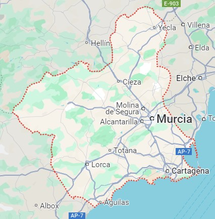
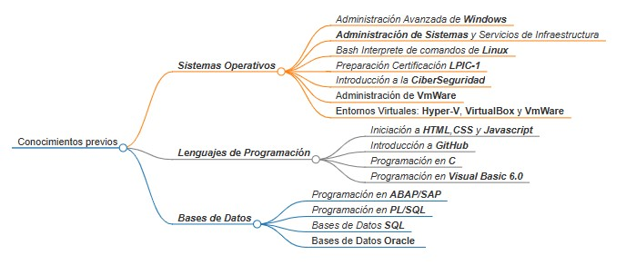

# Mi primer perfil en GitHub by EMGH7453
---

- ## 👋 Quien soy...

	Soy  un estudiante del [IES "Los Albares de Cieza"](https://www.ieslosalbares.es/  "WEB IES Los Albares de Cieza") es su extensión [CIFP "La Conservera"](https://sites.google.com/view/fplaconservera/ies-los-albares-de-cieza?authuser=0 "Web CIFP La Conservera")
	,situado la locacidad de Cieza que pertenece a la Region de Murcia
	
	

	Estoy matriculado en el primer curso del **Grado Superior de Desarrollo de Aplicaciones WEB** , en modalidad OnLine , tambien conocido por sus siglas *DAW*
- ## 🎓 Estas son las **Asignaturas** que hay en **Plan de Estudios 2024-2025** en el primer curso de *DAW* 

	| Asignaturas 1º DAW | Curso Académico 2024/25|
	|---|---|
	|Sistemas Informaticos|Programación|
	|Bases de Datos|Lenguajes de Marcas y Sistemas de Gestion de Información|
	|Entornos de Desarrollo|Itineraio Personal para la Empleabilidad|
	|Inglés Profesional|Digitalización Aplicada a los Sectores Productivos|
	
	
	> "Como es tu primer año en un grado de formacion profesional tienes que cursar todas las asiganturas"
	>
	> Secretaria del [IES los albares de cieza](https://www.ieslosalbares.es/  "WEB IES Los Albares de Cieza")
	
	
	### Más información en la web todofp.es
	
	
	
	
	
	
- ##  🏃‍ Antes de llegar a este modulo he realizado bastantes **Cursos** 
	
	

	Hecho en 
	
		
- ## 💞️ En este curso vamos a aprender a usar

	- Frameworks:
       - React
       - Node.js
       - Express
    - Bases de datos:
       - MongoDB
       - Docker

- ## 😄 Mi Objetivo es....

	Mejorar en mi carrera profesional convirtiendome en **"Analista de datos"**
	
	Para ello cuando termine este **Grado Superior** haré la especialización con el [***Curso de Especialización en Inteligencia Artificial y Big Data***](https://todofp.es/que-estudiar/familias-profesionales/informatica-comunicaciones/ce-inteligencia-artificial-bigdata.html "Curso Especialización")
	
	Aquí tienes toda la normativa sobre esta especialización [Enlace al **BOE** de la Especialización](./pdf/BOE-A-2021-7686.pdf)
	
	

- ## 📫 Algunas Citas Inspiradoras 
	
	> ### "Renovarse o morir...."
	> ### "No es *Magía*,  son *Datos*"
	> ### "HTM..., qué?
	> ### "En formacion continua o en continua formación, tu decides"

	
	
	
	

<!---
Texto inicial:
---------------
- 👋 Hi, I’m @emgh7453
- 👀 I’m interested in ...
- 🌱 I’m currently learning ...
- 💞️ I’m looking to collaborate on ...
- 📫 How to reach me ...
- 😄 Pronouns: ...
- ⚡ Fun fact: ...
---------------

emgh7453/emgh7453 is a ✨ special ✨ repository because its `README.md` (this file) appears on your GitHub profile.
You can click the Preview link to take a look at your changes..

[más información](https://www.todofp.es/que-estudiar/familias-profesionales/informatica-comunicaciones/des-aplicaciones-web.html "página de DAW en todofp.es")

Listado de cursos:
	
	- ***Sistemas Operativos***
		- *Administración Avanzada de **Windows***
		- ***Administración de Sistemas** y Servicios de Infraestructura*
		- *Bash Interprete de comandos de **Linux***
		- *Preparación Certificación **LPIC-1***
		- *Introducción a la **CiberSeguridad***
		- Administración de VmWare
		- Entornos Virtuales Hyper-V, VirtualBox y VmWare
		
	- ***Lenguajes de Programación***
		- *Iniciación a **HTML**,**CSS** y **Javascript***
		- *Introducción a **GitHub***
		- *Programación en **C***
		- *Programación en **Visual Basic 6.0***
		
	- ***Bases de Datos***
		- *Programación en **ABAP/SAP***
		- *Programación en **PL/SQL***
		- *Bases de Datos **SQL***
		- *Bases de Datos **Oracle***
	- ***y algunos más..***
--->
